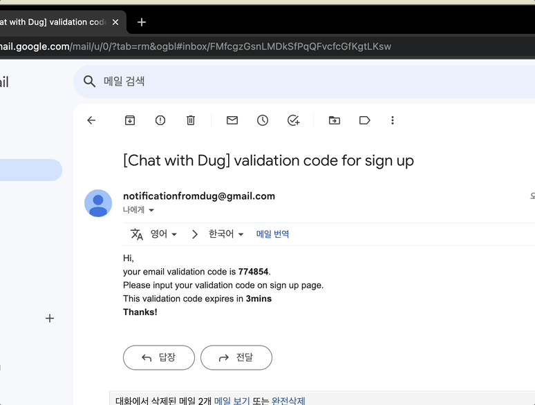
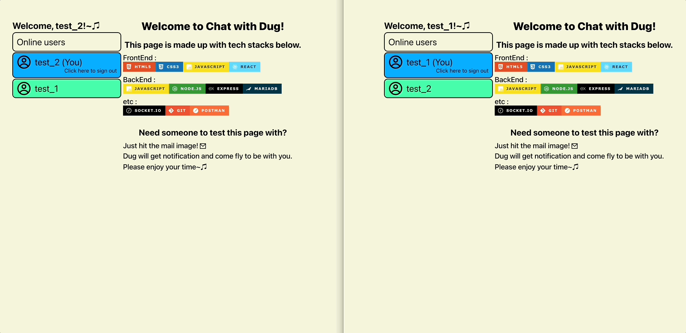

# chatwithdug_frontend(kr)

##### [Click here for English version](README_EN.md)

##### [日本語バージョンはこちらをクリックして下さい](README_JP.md)

## - 목차 -

1. 개요
2. 프로젝트목표
3. 기능시연
4. 개선필요내용
    
    

### 1. 개요

- 프로젝트명 : chatwithdug_frontend
- URL : https://chatwithdug.netlify.app
- 기간 : 2023.03.01 - 2023.04.27(2개월)
- 인원 : 1인
- 기술스택 :  
  
  
  
  
  
  
   
   

### 2. 프로젝트목표

1. WebSocket을 활용한 채팅 사이트를 구현 할 것
2. 회원관련 기능을 구현 할 것
3. 백엔드서버와 연동 가능하도록 구현 할 것
4. 배포하여 유지 보수, 운용 할 것
    
    

### 3. 기능시연  

1. 회원가입 및 로그인 
   
   
2. 채팅방 초대거절 
   
3. 채팅방 초대수락 
   
4. 채팅방 사용 
   
5. 채팅방 퇴장 
   
    
    

### 4. 개선필요내용

- 전체적인 UI 개선
