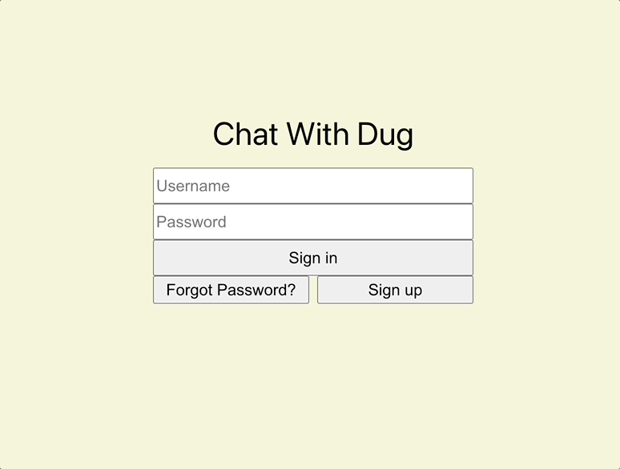
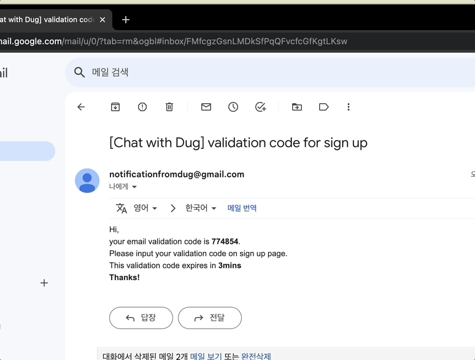
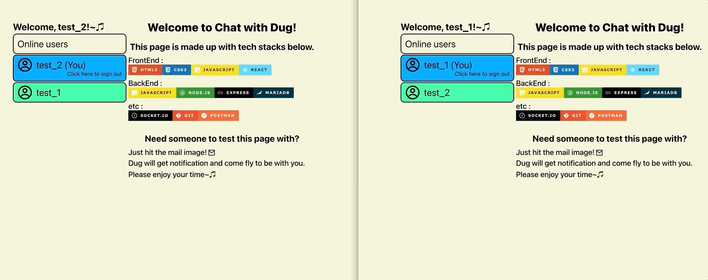
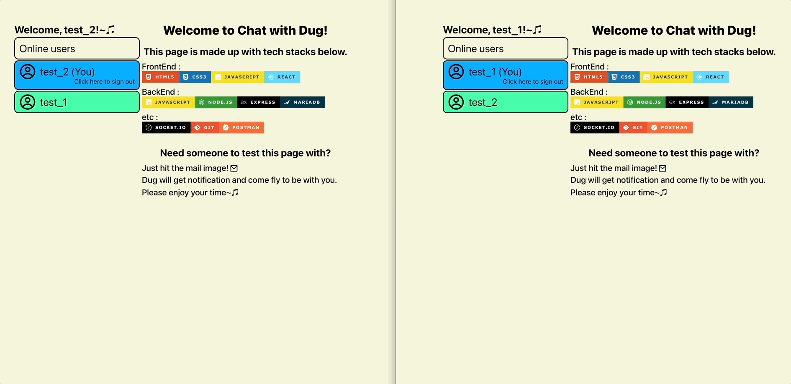
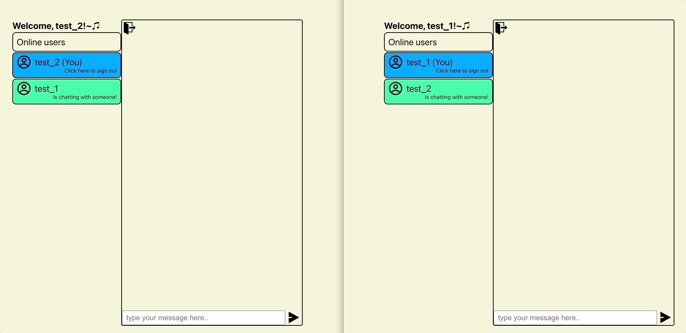

# chatwithdug_frontend(en)

##### [한국어 버전은 이 곳을 클릭해주세요](README.md)

##### [日本語バージョンはこちらをクリックして下さい](README_JP.md)

## - Index -

1. Overview
2. Project goal
3. Features demo
4. What needs to get fixed
    
    

### 1. Overview

- Project title : chatwithdug_frontend
- URL : https://chatwithdug.netlify.app
- Period : Mar 01 2023 - Apr 27 2023(2months)
- Member(s) : Dug Park
- Tech stack :  
  
  
  
  
  
  
   
   

### 2. Project goal

1. Creating a simple chat page using WebSocket
2. Creating pages to manage members
3. Have to be able to interact with backend server
4. Have to deploy for maintenance and operation
    
    

### 3. Features demo  

1. Sign up and Sign in 
   
   
2. Invite and deny 
   
3. Invite and accept 
   
4. Chatting 
   
5. Leave room 
   
    
    

### 4. What needs to get fixed

- Overall UI improvement
