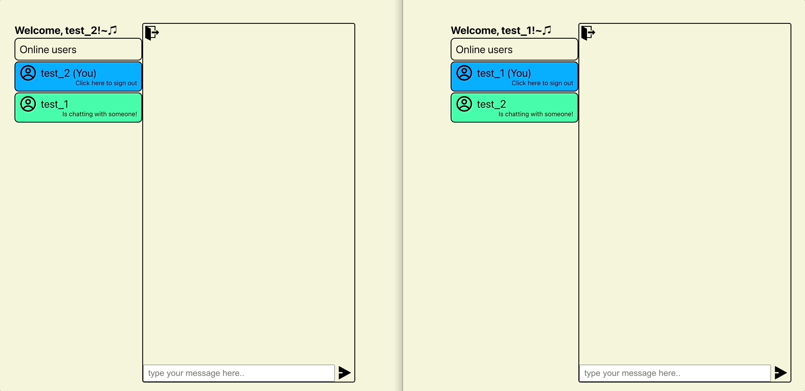

# chatwithdug_frontend(jp)

##### [한국어 버전은 이 곳을 클릭해주세요](README.md)

##### [Click here for English version](README_EN.md)

## - 目次 -

1. 概要
2. Project 目標
3. 機能試演
4. 改善必要内容
    
    

### 1. 概要

- Project タイトル: chatwithdug_frontend
- URL : https://chatwithdug.netlify.app
- 期間 : 2023.03.01 - 2023.04.27(2 ヶ月)
- 人員 : 1 人
- 技術スタック :  
  
  
  
  
  
  
   
   

### 2. Project 目標

1. WebSocket を活用したチャットページを具現する事
2. 会員関連機能を具現する事
3. backend server との連動出来るように具現する事
4. 配布して維持保守、運用する事
    
    

### 3. 機能試演  

1. 会員加入及びログイン 
   
   
2. チャットルーム招待断り 
   
3. チャットルーム招待承諾 
   
4. チャットルーム利用 
   
5. チャットルーム退場 
   
    
    

### 4. 改善必要内容

- 全体的な UI 改善
